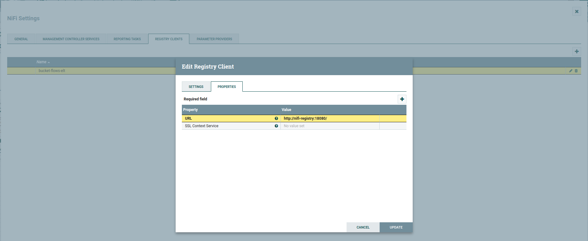
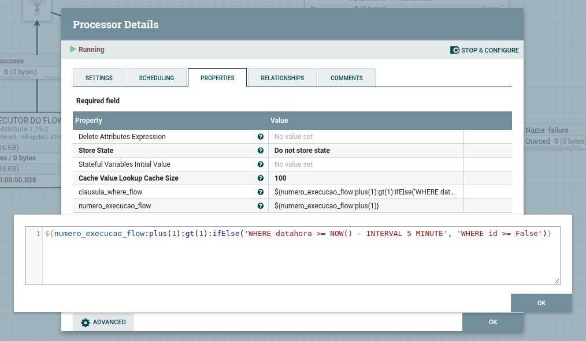

# Integração Entre Bases de Dados Heterogêneas 


Trata-se de um processo de ***ELT*** (Extração, Carga e Transformação) que integra um sistema legado com um banco de dados ***relacional*** (no exemplo, um MySQL) para um banco ***NoSQL*** (ElasticSearch) sem alterações significativas nos dados transferidos.

Para implementar esse fluxo de ELT, optou-se por uma arquitetura baseada em containers para todas as aplicações. A simulação do sistema legado também foi feita por meio de containers, com um para o ***MySQL*** e outro para o sistema de ***ERP*** (uma aplicação em ***Python*** que cadastra novos clientes e vendas de maneira contínua). O servidor ***Apache Nifi*** é o responsável por se conectar ao database do sistema legado e enviar, de forma contínua, para o ***Elasticsearch*** todos os novos clientes e vendas registrados no ERP. Além disso, o container com ***Kibana*** é utilizado para visualização do resultado da integração.

Nesse exemplo específico, foram criados dois flows separados, um para capturar novos clientes e outro para novas vendas. Ambos os flows são versionados pelo ***Apache Nifi Registry*** e são executados continuamente, capturando novos dados à medida que são inseridos no sistema legado. Esses dados são capturados e enviados para o banco de dados NoSQL, sem grandes alterações em sua estrutura original. Dessa forma, garantimos uma integração eficiente entre as bases que são heterogêneas.


#### Apache Nifi

Apache Nifi é uma plataforma open source que permite o gerenciamento e processamento de dados em tempo real de forma simples e escalável. Ele foi desenvolvido para lidar com fluxos de dados em ambientes distribuídos, oferecendo uma interface gráfica amigável para o desenvolvimento de pipelines de dados. O Apache Nifi suporta diversos tipos de fontes de dados, incluindo sistemas de arquivos, bancos de dados, serviços web, fluxos de dados, e muitos outros. Além disso, ele oferece integração com outras ferramentas de Big Data, como Apache Hadoop, Spark, e Hive.


#### Apache Nifi Registry

O Apache Nifi Registry é um subprojeto do Apache Nifi que fornece um repositório central para gerenciamento de versionamento, controle de acesso e colaboração para flows do Apache Nifi. Isso permite que as organizações gerenciem seus flows de forma mais eficiente e compartilhem seu trabalho com outras pessoas de maneira controlada e segura.


#### Elasticsearch

Elasticsearch é uma ferramenta de busca e análise de dados distribuída que é amplamente utilizada para buscar, analisar e visualizar grandes conjuntos de dados em tempo real. É um banco de dados NoSQL que é otimizado para armazenar, pesquisar e analisar grandes volumes de dados não estruturados. O Elasticsearch é escalável e flexível, permitindo que os usuários realizem pesquisas e análises avançadas em seus dados em tempo real.


#### Kibana

Kibana é uma ferramenta de visualização de dados que funciona em conjunto com o Elasticsearch, permitindo a criação de gráficos, dashboards e relatórios interativos para ajudar a entender e extrair insights a partir dos dados armazenados. Ele oferece uma interface amigável que permite a criação de painéis personalizados com diferentes tipos de visualizações, incluindo gráficos de barras, tabelas, mapas, e muitos outros. O Kibana é amplamente utilizado em ambientes de análise de dados e big data para monitoramento de sistemas, detecção de fraudes, análise de logs, e muitas outras aplicações.


#### Docker

Docker é uma plataforma de virtualização de aplicativos que permite que os aplicativos sejam executados em ambientes isolados e portáteis chamados contêineres. Cada contêiner inclui todos os componentes necessários para executar um aplicativo, como código, bibliotecas, dependências e configurações. Isso permite que os desenvolvedores criem, gerenciem e implantem aplicativos de forma mais rápida e consistente em diferentes ambientes.


#### Docker Compose

O Docker Compose é uma ferramenta que permite que os usuários definam e executem aplicativos Docker compostos por vários contêineres. Ele usa um arquivo YAML para definir as configurações de cada contêiner e suas dependências. Isso facilita o gerenciamento de aplicativos complexos que requerem vários contêineres, permitindo que eles sejam gerenciados como uma unidade.

O Docker e o Docker Compose são amplamente usados no desenvolvimento de aplicativos modernos, especialmente em ambientes de desenvolvimento e produção baseados em nuvem. Eles permitem que os desenvolvedores criem aplicativos de forma rápida e consistente, reduzindo a complexidade do gerenciamento de dependências e configurações em diferentes ambientes. Além disso, o uso de contêineres permite que os aplicativos sejam escalonados facilmente, garantindo que as alterações feitas em um contêiner não afetem outros contêineres em execução no mesmo host.


# Implementação


#### Clonando o repositório para iniciar a implementação

```bash
git clone https://github.com/Renatoelho/fluxo-elt.git "fluxo-elt"
```

```bash
cd fluxo-elt/
```


#### Fazendo o build da imagem que simula o ERP

```bash
cd ERP/
```

```bash
docker build -f dockerfile -t erp-sistema:0.0.1 .
```


#### Ativando todos os serviços do fluxo

```bash
cd ..
```

```bash
docker-compose -f docker-compose.yaml --compatibility up -d
```

> ***IMPORTANTE:*** No primeiro start dos serviços, pode ocorrer um erro no serviço 'nifi-registry' se a permissão de acesso ao volume criado for negada. Nesse caso, desative os serviços e ***altere as permissões do volume***. Use o comando '***sudo chmod -R 777 volumes/nifi_registry/***' e, em seguida, suba novamente os serviços. Tudo deve funcionar corretamente.


#### Monitorando a saúde dos contêiners (healthcheck)

O ***healthcheck*** é um recurso oferecido pelo Docker e implementado no Docker-compose que permite que você monitore o estado de um contêiner em tempo real e detecte se ele está ou não funcionando corretamente. 

Existe um healthcheck para cada contêiner do fluxo:

- ***Contêiner Sistema ERP:*** test: curl -f http://erp-app:8888/healthcheck || exit 1

- ***Contêiner Database ERP:*** test: mysqladmin ping -h erp-database -u root -pd8Uwj1wos64h || exit 1

- ***Contêiner Apache Nifi:*** test: wget -q --spider http://nifi-server:8443/nifi-api/system-diagnostics || exit 1

- ***Contêiner Apache Nifi Registry:*** test: wget -q --spider http://nifi-registry:18080/nifi-registry/ || exit 1

- ***Contêiner Elasticsearch:*** test: curl -f http://elasticsearch:9200/_cluster/health || exit 1

- ***Contêiner Kibana:*** test: curl -f http://kibana:5601/ || exit 1

Para verificar a saúde dos contêiners execute o seguinte comando e verifique no atributo 'STATUS'.

```bash
docker ps
```


#### Persistindo dados do Fluxo (Volumes)

Os volumes no Docker são um recurso que permite compartilhar dados entre o host e os contêineres de uma forma flexível e independente do sistema de arquivos do host. Os volumes permitem que você armazene dados persistentes fora do contêiner e acesse esses dados de forma consistente em diferentes contêineres.

Quase todos os contêineres existentes podem estar associados a um ou mais volumes, que podem ser definidos no contexto do Docker Compose ou diretamente no gerenciador de volumes do Docker. Para obter informações sobre os volumes utilizados no fluxo, consulte o arquivo [docker-compose.yaml](docker-compose.yaml) ou use os comandos de gerenciamento de volumes do Docker.

```bash
docker volume ls
```


#### Configurando o Versionamento dos Flows no Apache Nifi Registry

Para acessar o Nifi e Nifi Registry use as seguintes URLs:

- https://localhost:8443/nifi/ (Usuário e senha no arquivo docker-compose.yaml)

- http://localhost:18080/nifi-registry/

***1º Passo:*** acesse o Registry e crie um *bucket* em:

***Settings >> New bucket***

Em ***Bucket Name*** adicione '*bucket-flows-elt*' e clique em ***CREATE***.


***2º Passo:*** Acesse o Apache Nifi (Usuário e senha no arquivo docker-compose.yaml) e execute em:

***Menu >> Controller Settings >> Registry Clients >> Add Registry Client***

Adicione em ***Name*** o mesmo nome do bucket criado no Registry '*bucket-flows-elt*' em ***Type*** escolha '***NifiRegistryFlowRegistryClient***' e clique em ***ADD***. Em seguida acesse novamente e clique em ***Edit*** e adicione na aba *PROPERTIES* a URL: http://nifi-registry:18080/ clique em ***UPDATE*** e tudo pronto. Agora seus Flows no Apache Nifi já podem ser versionados.

- Configurações:



- Versionamento:


#### Acessando o Database do Sistema ERP

Esta etapa não se destina apenas a visualizar os dados existentes no banco de dados do ERP, mas também a aproveitar as regras de negócio para desenvolver as consultas que serão usadas para extrair os dados do ERP. É possível utilizar qualquer gerenciador de banco de dados, ou o gerenciador exclusivo do banco em questão. Neste exemplo, utilizaremos o [Dbeaver](https://dbeaver.io/download/), que é adequado para qualquer banco de dados relacional.

Temos as queries originais que refletem as regras de negócio, bem como as queries ajustadas que serão utilizadas no Apache NiFi. Estas últimas possuem algumas regras para que a query seja alternada entre a primeira execução, que faz uma carga completa, e em todas as demais execuções, apenas as incrementais são executadas. Abaixo estão os exemplos de queries originais e ajustadas para serem executadas no fluxo do Apache NiFi:

> As credenciais de acesso ao banco de dados estão no arquivo [docker-compose.yaml](docker-compose.yaml).

- Originais:

***Clientes***

```SQL
SELECT
	id,
	nome ,
	sobrenome,
	email,
	telefone,
	DATE_FORMAT(data_nascimento, '%Y-%m-%d') data_nascimento,
	cidade,
	estado,
	pais,
	codigo_pais,
	DATE_FORMAT(datahora, '%Y-%m-%d %H:%i:%s') datahora
FROM db_erp.clientes
-- WHERE datahora >= NOW() - INTERVAL 1 MINUTE 
-- WHERE id >= False
ORDER BY id;
```

***Vendas***

```SQL
SELECT
	id,
	produto,
	DATE_FORMAT(data_compra, '%Y-%m-%d') data_compra,
	tipo_cartao,
	numero_cartao,
	quantidade,
	valor,
	DATE_FORMAT(datahora, '%Y-%m-%d %H:%i:%s') datahora
FROM db_erp.vendas
-- WHERE datahora >= NOW() - INTERVAL 1 MINUTE 
-- WHERE id >= False
ORDER BY id;
```

Ajustadas para o Apache Nifi:

***Clientes***

```SQL
SELECT
	id,
	nome ,
	sobrenome,
	email,
	telefone,
	DATE_FORMAT(data_nascimento, '%Y-%m-%d') data_nascimento,
	cidade,
	estado,
	pais,
	codigo_pais,
	DATE_FORMAT(datahora, '%Y-%m-%d %H:%i:%s') datahora
FROM db_erp.clientes
${clausula_where_flow}
ORDER BY id;
```

***Vendas***

```SQL
SELECT
	id,
	produto,
	DATE_FORMAT(data_compra, '%Y-%m-%d') data_compra,
	tipo_cartao,
	numero_cartao,
	quantidade,
	valor,
	DATE_FORMAT(datahora, '%Y-%m-%d %H:%i:%s') datahora
FROM db_erp.vendas
${clausula_where_flow}
ORDER BY id;
```

As variáveis '***clausula_where_flow***' e '***numero_execucao_flow***' no Apache Nifi são responsáveis por definir se será uma carga inicial completa ou cargas incrementais, isso para os Flows de Clientes e Vendas, que neste caso serão feitas a cada 5 minutos. Para mais detalhes sobre essa regra, consulte o fluxo.

Exemplo da lógica para execução das cargas



> ***IMPORTANTE:*** Essa regra de captura dos registros inseridos nos últimos 5 minutos é apenas uma abordagem conceitual, podendo ocorrer falhas na recuperação dos dados do banco. Para uma execução com grande grau de precisão, a inclusão de algumas variáveis de controle é necessária, mas não é o escopo do nosso contexto aqui.


#### Configurando os Flows no Apache Nifi

Um dos primeiros passos no desenvolvimento de Flows no Apache NiFi é verificar se as conexões aos bancos de dados estão criadas e funcionando. Para isso, os 'controller services' são utilizados. No nosso exemplo, teremos um controller service para o MySQL via JDBC e outro para Elasticsearch.

- ***Para criar um controller service, é necessário acessar:***

***Configuration (Engrenagem) >> Controller Services >> Create a new controller service***

Depois disso, é necessário escolher e configurar um '***DBCPConnectionPool 1.19.0***' e um '***JsonRecordSetWriter 1.19.0***' para o MySQL, além de um '***ElasticSearchClientServiceImpl 1.19.0***' para o Elasticsearch. No caso do MySQL, é uma configuração JDBC comum, e é necessário um controller service para converter o resultado da query em um arquivo JSON. Já no caso do Elasticsearch, é necessário informar a URL HTTP://..., o nome de usuário e a senha do servidor Elastic


- ***Controller Services***


- ***Conexão com MySQL***


- ***Conexão com Elasticsearch***


- ***Lógica para extração contínua a cada 5 Minutos***


- ***Separa o resultado da Query SQL em um arquivo Json para cada linha***


- ***Grava no Elasticsearch em formato Json***


- ***Ativando os Flows no Apache Nifi***

***IMPORTANTE:*** O processor '***EXECUTOR DO FLOW (EXECUTA UM VEZ)***' deve ser executado uma única vez e em seguida desabilitado, pois ele é responsável por gerar a variável '***numero_execucao_flow***', que será utilizada para definir se a execução da query do MySQL será completa ou incremental (ou seja, apenas os registros dos *últimos 5 minutos*), pelo processor '***REEXECUTOR DO FLOW***'.

Ative o Flow depois de executar o procedimento do processor '***EXECUTOR DO FLOW (EXECUTA UM VEZ)***'.

Clique com botão diretito do mouse na parte em branco do Flow e em seguida em "Start".


- ***Flow Completo e Ativo - Clientes***


> ***Obs.:*** Todo esse detalhamento do fluxo é para a extração de clientes. Para as vendas, há um fluxo com a mesma estrutura lógica, mas com uma query de início do MySQL e um índice de destino no Elasticsearch diferentes.

#### Visualizando o resultado no Elasticsearch e Kibana

Em Desenvolvimento...


#### Considerações Finais

Em Desenvolvimento...


# Referências

Apache/Nifi, ***Docker Hub***. Disponível em: <https://hub.docker.com/r/apache/nifi>. Acesso em: 19 abr. 2023.

NiFi System Administrator’s Guide, ***Apache NiFi***. Disponível em: <https://nifi.apache.org/docs/nifi-docs/html/administration-guide.html>. Acesso em: 22 abr. 2023.

apache/nifi-registry, ***Docker Hub***. Disponível em: <https://hub.docker.com/r/apache/nifi-registry>. Acesso em: 22 abr. 2023.

Getting Started with Apache NiFi Registry, ***Apache NiFi Registry***. Disponível em: <https://nifi.apache.org/docs/nifi-registry-docs/index.html>. Acesso em: 22 abr. 2023.

How to build a data lake from scratch - Part 1: The setup, ***Victor Seifert***. Disponível em: <https://towardsdatascience.com/how-to-build-a-data-lake-from-scratch-part-1-the-setup-34ea1665a06e>. acesso em: 19 abr. 2023.

How to build a data lake from scratch — Part 2: Connecting the components, ***Victor Seifert***. Disponível em: <https://medium.com/towards-data-science/how-to-build-a-data-lake-from-scratch-part-2-connecting-the-components-1bc659cb3f4f>. acesso em: 23 abr. 2023.

How to Successfully Implement A Healthcheck In Docker Compose, ***Linuxhint***. Disponível em: <https://linuxhint.com/how-to-successfully-implement-healthcheck-in-docker-compose/>. Acesso em: 24 abr. 2023.

Volumes, ***Docker Docs***. Disponível em: <https://docs.docker.com/storage/volumes/>. Acesso em: 24 abr. 2023.

Elasticsearch, ***Docker Hub***. Disponível em: <https://hub.docker.com/_/elasticsearch>. Acesso em: 25 abr. 2023.

Kibana, ***Docker Hub***. Disponível em: <https://hub.docker.com/_/kibana>. Acesso em: 25 abr. 2023.

Expression Language Guide, ***Apache NiFi Expression Language Guide***. Disponível em: <https://nifi.apache.org/docs/nifi-docs/>. Acesso em: 26 abr. 2023.


Texto, ***Origem***. Disponível em: <URL>. Acesso em: XX abr. 2023.